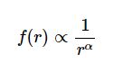

# Softdes Project2, is Poetry Zipfy?
 Data Collection and Prossesing Project for Olin College Class Software Design 
 
 The aim of this project is to determine if poetry follows Zipfs law, or that 
 the frequency of how much a word appears in a set of words is proportional to
 1 / appearance rank such that: 
 
 
 
 Where *f* is frequency and **r** is rank. This project involved scraping poems 
 off of [poemhunter.com](poemhunter.com) and creating various plots to determine
 if poetry and various poets follows Zipf's law. If you want to find the results, 
 methodology, and conclusions please refference main.ipynb (or the .pdf version) 
 which is the Jupyter Notebook file of the written computational essay. 
 
 To run the Notebook you will need python 3.8 (prefferably [anaconda](https://docs.continuum.io/anaconda/)) and to 
 download a few dependancies:
 
 #### Beautiful Soup
 
 in addition to the included `requests` library, `Beautiful Soup` more easily enables
 python-html interaction, being a valueble tool for scraping data off of websites to 
 download run: 
 
 `$ apt-get install python3-bs4`
 
 Find out more about the library and installation [here](https://www.crummy.com/software/BeautifulSoup/bs4/doc/)
 
 #### Matplot Lib
 
 Is used to create all the plots for the notebook downlaod using:
 
 `$ sudo apt-get install python3-matplotlib`
 
 Find out more about the library and installation [here](https://matplotlib.org/users/installing.html)
 
 #### Pandas
 
 Pandas creates dataframes that makes managign and organizing large groups of data a lot
 easier, if you have anaconda it's included otherwise download guide [here](https://pandas.pydata.org/docs/getting_started/install.html)
 
 #### Scipy
 
 Used for non-linear curve fit, download by using: 
 
 `$ sudo apt-get install python-scipy`
 
 Find out more about the library and installation [here](https://www.scipy.org/index.html)
 
 #### Language Tool Python 
 
 Helps with some of the text formatting when scraping large amounts of data to install via pip use:
 
 `$ pip install --upgrade language_tool_python`

 Find out more about the library and installation [here](https://pypi.org/project/language-tool-python/)
